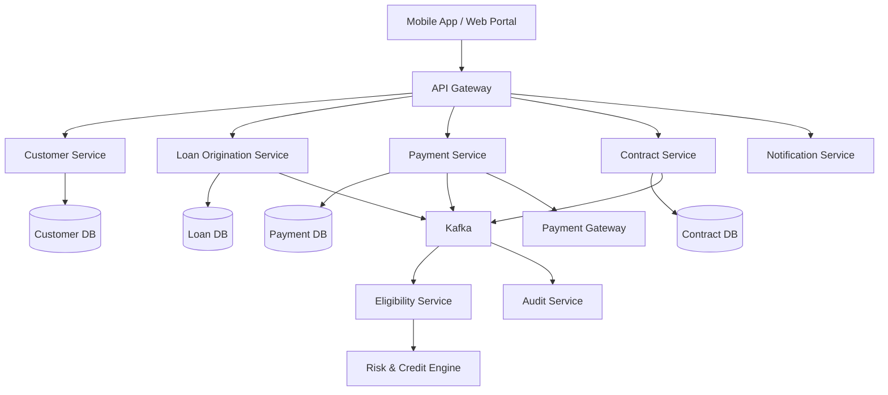
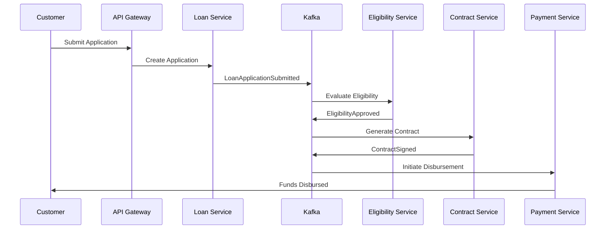
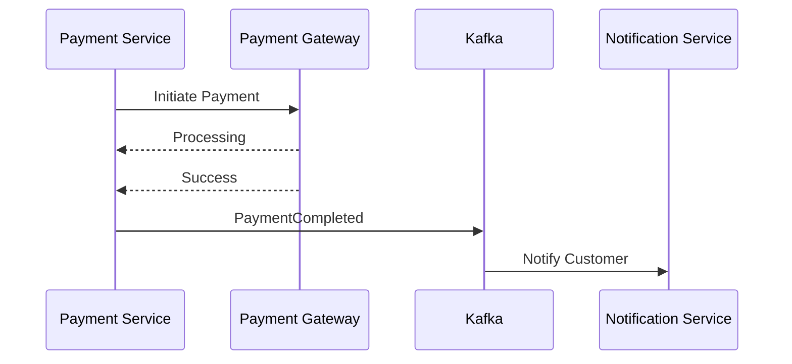

# FinTech Microservices Architecture

Reference architecture for building scalable digital lending and financial platforms using Spring Boot, Apache Kafka, PostgreSQL, Redis, Keycloak, and cloud-native deployment patterns.

## Overview

This repository demonstrates a production-grade microservices architecture commonly used in modern FinTech platforms.

The design focuses on:

* Loan Origination Systems (LOS)
* Customer Onboarding
* Eligibility Evaluation
* Contract Lifecycle Management
* Payment Processing
* Event-Driven Communication
* Security & Compliance
* Cloud-Native Scalability

---

## Architecture Diagram

---

## Core Services

| Service                  | Responsibility                   |
| ------------------------ | -------------------------------- |
| API Gateway              | Routing, Security, Rate Limiting |
| Customer Service         | Customer Profile & Onboarding    |
| Loan Origination Service | Application & Offer Processing   |
| Eligibility Service      | Risk Assessment & Scoring        |
| Contract Service         | Contract Generation & Signing    |
| Payment Service          | Loan Disbursement & Repayment    |
| Notification Service     | SMS, Email, Push Notifications   |
| Audit Service            | Compliance & Audit Tracking      |

---

## Event Driven Communication

Apache Kafka is used for asynchronous communication between services.

Example business events:

* CustomerCreated
* LoanApplicationSubmitted
* EligibilityApproved
* ContractGenerated
* ContractSigned
* PaymentInitiated
* PaymentCompleted

---

## Technology Stack

| Layer      | Technology            |
| ---------- | --------------------- |
| Backend    | Java, Spring Boot     |
| Messaging  | Apache Kafka          |
| Database   | PostgreSQL            |
| Cache      | Redis                 |
| Security   | Keycloak, OAuth2, JWT |
| Monitoring | ELK, Grafana          |
| Deployment | Docker, Kubernetes    |
| CI/CD      | Jenkins               |

---

## Loan Origination Flow

---

## Payment Processing Flow

---

## Design Principles

### Database Per Service

Each microservice owns its own database to ensure loose coupling and independent scalability.

### Event-Driven Architecture

Business events are exchanged through Kafka to improve resiliency and reduce service dependencies.

### Idempotent Payments

Payment APIs must support idempotency to prevent duplicate financial transactions.

### Security First

All services are secured using OAuth2, JWT tokens, and role-based access control.

### Observability

Centralized logging, metrics, and tracing are mandatory for financial systems.

---

## Future Enhancements

* Saga Pattern Implementation
* Outbox Pattern
* Event Sourcing
* Multi-Tenant Architecture
* AI-Powered Customer Assistant
* Open Banking Integrations

---

## Author

Mohammad Adil

🏦 FinTech Backend Lead
☕ Java Architect
🤖 AI Engineer

Building scalable financial platforms and AI-powered solutions.
