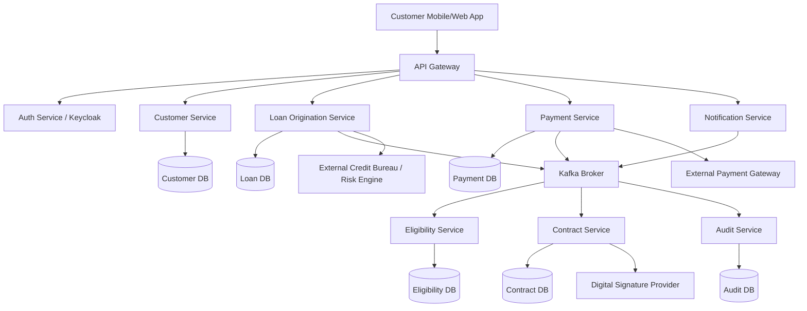
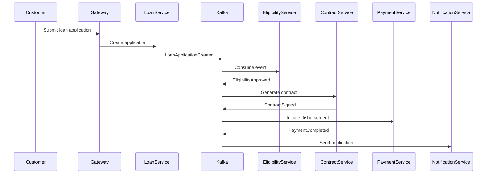
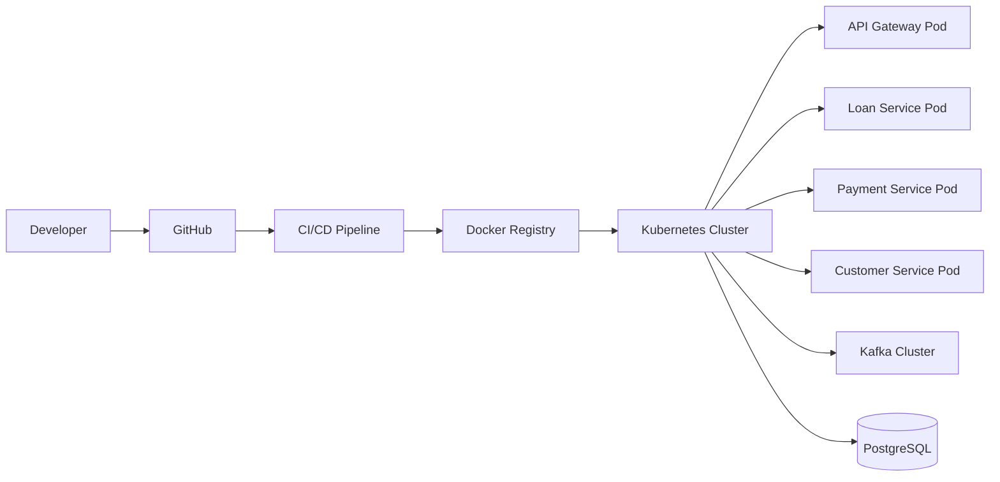

# FinTech Microservices Architecture

A reference architecture for building scalable, secure, and event-driven FinTech platforms using Java, Spring Boot, Apache Kafka, PostgreSQL, Redis, Keycloak, and cloud-native deployment patterns.

## Overview

This repository demonstrates a high-level microservices architecture for a digital lending and financial services platform.

It focuses on system design, service boundaries, event-driven communication, security, scalability, observability, and deployment patterns commonly used in modern FinTech systems.

## Architecture Goals

* Scalable microservices design
* Event-driven communication using Kafka
* Secure authentication and authorization
* Reliable payment and loan processing
* Distributed transaction handling
* Observability and monitoring
* Cloud-ready deployment model

## High-Level Architecture

## Core Microservices

| Service                  | Responsibility                                             |
| ------------------------ | ---------------------------------------------------------- |
| API Gateway              | Request routing, rate limiting, authentication forwarding  |
| Customer Service         | Customer profile, onboarding, KYC data                     |
| Loan Origination Service | Loan application, eligibility, offer, approval workflow    |
| Eligibility Service      | Business rules, scoring, risk checks                       |
| Contract Service         | Contract generation, digital signature, document lifecycle |
| Payment Service          | Disbursement, repayment, payment status tracking           |
| Notification Service     | SMS, email, push notifications                             |
| Audit Service            | Audit logs, compliance events, traceability                |

## Event-Driven Flow

## Technology Stack

| Layer       | Technology               |
| ----------- | ------------------------ |
| Backend     | Java, Spring Boot        |
| API Gateway | Spring Cloud Gateway     |
| Messaging   | Apache Kafka             |
| Database    | PostgreSQL               |
| Cache       | Redis                    |
| Security    | Keycloak, JWT, OAuth2    |
| Monitoring  | ELK, Grafana, Prometheus |
| Deployment  | Docker, Kubernetes       |
| CI/CD       | Jenkins, GitHub Actions  |

## Security Design

* OAuth2 / OpenID Connect based authentication
* JWT-based API authorization
* Role-based access control
* Service-to-service authentication
* API Gateway level request validation
* Secure secrets management
* Audit logging for sensitive actions

## Reliability Patterns

* Idempotency keys for payment and loan operations
* Retry with exponential backoff
* Dead Letter Topics for failed Kafka events
* Circuit breaker for external integrations
* Distributed locking for scheduled jobs
* Outbox pattern for reliable event publishing

## Observability

* Centralized logging using ELK
* Distributed tracing using correlation IDs
* Metrics collection using Prometheus
* Dashboards using Grafana
* Business alerts for payment, loan, and onboarding failures

## Deployment View

## Key Design Decisions

### 1. Database per Service

Each microservice owns its own database to avoid tight coupling and improve independent scalability.

### 2. Kafka for Asynchronous Communication

Kafka is used for business events such as loan application creation, eligibility approval, contract signing, and payment completion.

### 3. API Gateway as Entry Point

All external traffic goes through the API Gateway for centralized routing, security, throttling, and logging.

### 4. Idempotent Payment Processing

Payment APIs must be idempotent to avoid duplicate disbursement or repayment processing.

### 5. Observability First

Business and technical monitoring are mandatory for FinTech platforms due to transaction sensitivity and compliance requirements.

## Suggested Repository Usage

This repository can be used as:

* FinTech system design reference
* Microservices architecture blueprint
* Interview preparation material
* Technical documentation sample
* Architecture portfolio project

## Future Enhancements

* Add detailed service-level API contracts
* Add database schema examples
* Add Kafka topic design
* Add Kubernetes deployment YAML samples
* Add Saga pattern implementation
* Add Outbox pattern example
* Add CI/CD pipeline sample

## Author

Mohammad Adil

FinTech Backend Lead | Java Architect | AI Engineer

Building scalable financial platforms and AI-powered solutions.
