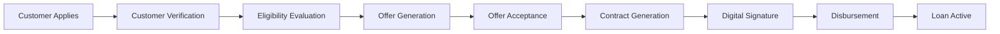

# Loan Origination Flow

```mermaid
flowchart LR

A[Customer Applies]
--> B[Customer Verification]

B --> C[Eligibility Evaluation]

C --> D[Offer Generation]

D --> E[Offer Acceptance]

E --> F[Contract Generation]

F --> G[Digital Signature]

G --> H[Disbursement]

H --> I[Loan Active]
```
