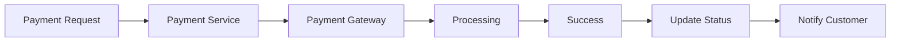

# Payment Processing Flow

```mermaid
flowchart LR

A[Payment Request]
--> B[Payment Service]

B --> C[Payment Gateway]

C --> D[Processing]

D --> E[Success]

E --> F[Update Status]

F --> G[Notify Customer]
```
